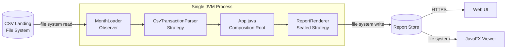
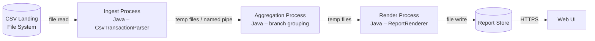
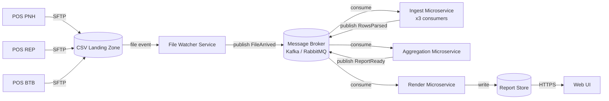

# Lab-01: ATAM Trade-Off Analysis (Challenge)

*Authors: Chiv Inthera (Member A) – QA-1 models & sensitivity | Kiv Sovannlyda (Member B) – container sketches & evaluation matrix*

---

## Part A – Quantitative QA-1 Performance Models *(Member A)*

> *[Member A to fill in Amdahl's Law calculations, sensitivity points, and trade-off points.]*

---

## Part B – Container Architecture Sketches *(Member B)*

### Architecture A – Modular Monolith Batch Job *(Chosen for Release 1, see ADR-0001)*

**Key characteristics**: single deployment unit, sequential I/O, compiler-enforced renderer exhaustiveness.

---

### Architecture B – Multi-Process Pipeline

**Key characteristics**: OS-level fault isolation per stage, restartable stages, inter-process I/O overhead.

---

### Architecture C – Event-Driven Microservices

**Key characteristics**: independent scaling, broker durability for QA-3, highest operational complexity.

---

## Part C – Comparative Evaluation Matrix *(Member B)*

Scoring: `++` = strong positive · `+` = positive · `0` = neutral · `-` = negative · `--` = strong negative

| Quality Attribute | A: Monolith Batch | B: Multi-Process | C: Event-Driven |
|---|:---:|:---:|:---:|
| **QA-1 Performance** (3M rows ≤ 60 s) | `+` Sequential I/O, predictable | `0` Stage overhead offsets parallelism | `+` Parallel consumers scale horizontally |
| **QA-2 Scalability** (+1 branch ≤ 35%) | `0` Linear scan, bounded by JVM | `+` Add a stage instance | `++` Scale ingest consumers independently |
| **QA-3 Availability** (missing file = INTERIM) | `+` skippedFiles map, continues processing | `+` Broken stage restartable | `++` Broker buffers events; idempotent replay |
| **QA-4 Modifiability** (new renderer ≤ 2 days) | `++` Sealed interface, compiler-checked | `0` New process + pipeline reconfigure | `-` New microservice, new topic, new deployment |
| **QA-5 Security** (branch isolation) | `+` Role-based Web UI layer | `+` Process-level isolation | `+` Service-level isolation; broker ACLs |
| **QA-6 Testability** (suite ≤ 30 s) | `++` Pure JUnit, no infrastructure | `0` Requires process orchestration in tests | `-` Requires embedded broker in tests |
| **Development Cost** | `++` Single repo, single build | `+` Multiple processes, one repo | `--` Multiple services, DevOps overhead |
| **Operational Cost** | `++` No infrastructure dependencies | `+` OS process manager only | `--` Broker cluster + observability stack |

---

## Part D – Risk Themes *(Member B)*

| # | Risk Theme | Affected Architecture | Probability | Impact | Mitigation |
|---|---|---|:---:|:---:|---|
| R1 | Single JVM becomes throughput bottleneck at 10 M+ rows | A | L | H | Plan migration to B or C at Release 2 threshold |
| R2 | Stage I/O latency in Multi-Process invalidates QA-1 SLA | B | M | H | Benchmark early; use memory-mapped files |
| R3 | Message broker unavailability blocks all ingest | C | M | H | Configure broker HA (replica factor ≥ 2); DLQ policy |
| R4 | Idempotency breach causes duplicate rows in aggregation | C | M | H | Composite key deduplication + SHA-256 file hash |
| R5 | Sealed interface blocks external renderer vendors (Release 3+) | A | L | M | Document migration path to ServiceLoader interface |

---

## Part E – Final Recommendation *(Member B)*

**ADR-0001 (Modular Monolith Batch Job) is confirmed for Release 1.**

The evaluation matrix shows Architecture A leads on QA-4, QA-6, development cost, and
operational cost — the four attributes most critical for a two-person team delivering
Release 1 under a semester timeline. Its single performance weakness (QA-2 at scale)
is a Risk R1 that can be deferred until the branch count exceeds five.

Architecture C is the recommended **target state for Release 3**, when external
renderer plugins and real-time dashboard requirements are expected to emerge.
Architecture B serves as a viable intermediate migration step if OS-level fault
isolation is required before the full microservices investment is justified.

The Amdahl's Law analysis (Part A) will quantify the exact branch-count threshold
at which Architecture A is no longer sufficient, providing a data-driven trigger
for the Release 2/3 migration decision.
