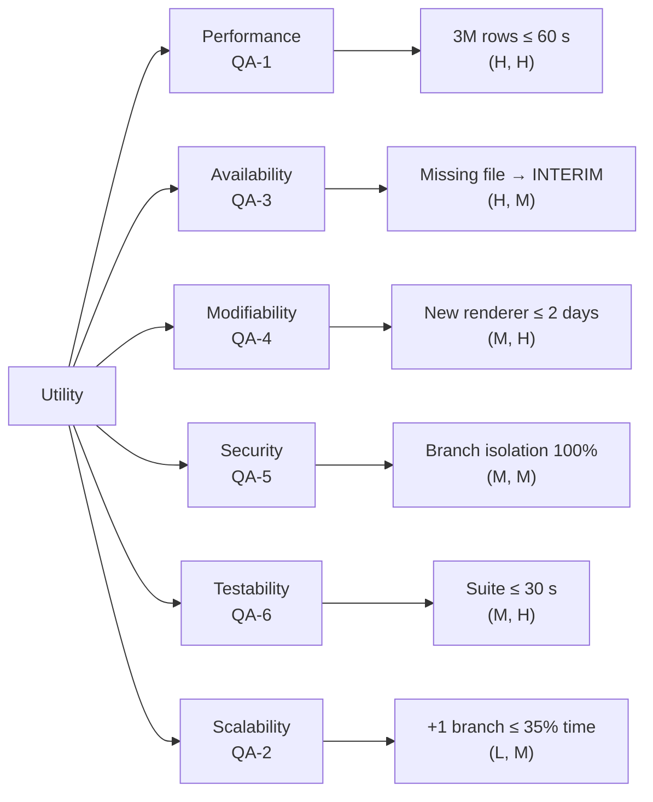

# Lab-01: Quality Scenarios, Utility Tree & C4 Diagrams

## Stakeholders

| Role | Concern |
|------|---------|
| **Analyst / Data Scientist** | Accurate, repeatable revenue figures for business intelligence. |
| **Branch Manager** | Fast per-branch reports to act on daily sales trends. |
| **Finance Director** | Chain-level summary integrity for regulatory and board reporting. |
| **Operations (IT)** | Automated, low-maintenance nightly batch; minimal on-call burden. |
| **Developers** | Readable, testable, modifiable codebase with < 30 s test cycle. |

---

## QA Scenarios

### QA-1 – Performance *(Member A)*

| Part | Detail |
|------|--------|
| **Source** | Finance Director |
| **Stimulus** | Month-end batch triggered at 01:00 with all 15 daily CSV files present |
| **Artifact** | `MonthLoader` + `CsvTransactionParser` processing pipeline |
| **Environment** | Reference server: 8-core CPU, 16 GB RAM, SSD, under normal load |
| **Response** | Produces a complete `MonthlyReport` with valid chain-total |
| **Response Measure** | Elapsed wall-clock time ≤ 60 s for 3 M rows across 5 consecutive runs |

---

### QA-2 – Scalability *(Member A)*

| Part | Detail |
|------|--------|
| **Source** | Operations (IT) |
| **Stimulus** | A fourth branch (e.g. Kampong Cham) is added, doubling the POS data volume |
| **Artifact** | `MonthLoader` branch-discovery and aggregation logic |
| **Environment** | Production server, end-of-month batch window |
| **Response** | Report includes all four branches with no configuration change |
| **Response Measure** | Elapsed time for the 4-branch run ≤ 135 % of the 3-branch baseline (≤ 35 % increase) |

---

### QA-3 – Availability *(Member A)*

| Part | Detail |
|------|--------|
| **Source** | Finance Director |
| **Stimulus** | One branch CSV file is missing or arrives late (e.g. BTB SFTP upload failed) |
| **Artifact** | `MonthLoader` fault-isolation and `MonthlyReport.skippedFiles()` map |
| **Environment** | Nightly batch at 01:00; head office wait window ends at 02:00 |
| **Response** | Batch completes; report is marked INTERIM for the missing branch; other branches are accurate |
| **Response Measure** | Zero unhandled exceptions; report produced within 120 min of window start; skipped file logged |

---

### QA-4 – Modifiability *(Member B)*

| Part | Detail |
|------|--------|
| **Source** | Developer (internal team request) |
| **Stimulus** | Product owner requests a new PDF report format |
| **Artifact** | `ReportRenderer` sealed interface and `ReportRenderer.forExtension()` factory |
| **Environment** | Development workstation; existing test suite must remain green |
| **Response** | A new `PdfReportRenderer` class implementing `ReportRenderer` is added and wired |
| **Response Measure** | Change delivered in ≤ 2 developer-days; zero modifications to `model` or `ingest` packages; all existing tests pass |

---

### QA-5 – Security *(Member B)*

| Part | Detail |
|------|--------|
| **Source** | Finance Director (compliance requirement) |
| **Stimulus** | Branch Manager from REP requests access to the monthly report portal |
| **Artifact** | `HtmlReportRenderer` output served over HTTPS; role-based access layer |
| **Environment** | Production web UI; authenticated session |
| **Response** | REP branch manager sees only REP branch data; PNH and BTB rows are not returned |
| **Response Measure** | No cross-branch data leak in 100 % of tested access-control scenarios; all HTML output is XSS-escaped |

---

### QA-6 – Testability *(Member B)*

| Part | Detail |
|------|--------|
| **Source** | Developer |
| **Stimulus** | Developer runs `mvn test` after any code change |
| **Artifact** | Full JUnit 6 test suite (model + ingest + render packages) |
| **Environment** | Developer workstation (no network, no database) |
| **Response** | All tests pass; coverage report generated |
| **Response Measure** | Entire suite completes in ≤ 30 s on the reference workstation |

---

## Quality Attribute Rankings

| Rank | QA | Justification |
|------|----|--------------|
| 1 | **QA-1 Performance** | Month-end reporting window is business-critical; late reports block board decisions. |
| 2 | **QA-3 Availability** | Missing branch data must not stop the chain report; partial INTERIM reports are acceptable. |
| 3 | **QA-4 Modifiability** | New output formats are the most frequent change request; sealed-renderer design gates this. |
| 4 | **QA-5 Security** | Regulatory obligation for per-branch data isolation; HTTPS + XSS escaping required. |
| 5 | **QA-6 Testability** | Fast test cycle is essential for confident refactoring; ≤ 30 s suite enforced. |
| 6 | **QA-2 Scalability** | Fourth branch is planned but not immediate; current batch can accommodate it without re-architecture. |

---

## Explicit Assumptions

1. All CSV files conform to the 10-column schema produced by `SampleData.java`; schema evolution is out of scope for Release 1.
2. The reference server has ≥ 8 CPU cores and ≥ 16 GB RAM; QA-1 timing is only guaranteed on equivalent hardware.
3. Network latency between branches and head office is managed by the SFTP infrastructure (ADR-0002); the batch system treats late files as "skipped".
4. User authentication and authorisation (QA-5) are implemented by an external identity layer; the `render` package performs XSS escaping only.
5. No more than 5 branches will be added in Release 1 lifecycle; beyond that, the architecture is reviewed.

---

## Utility Tree

*Leaf format: (Business Importance, Technical Risk) where H=High, M=Medium, L=Low.*
